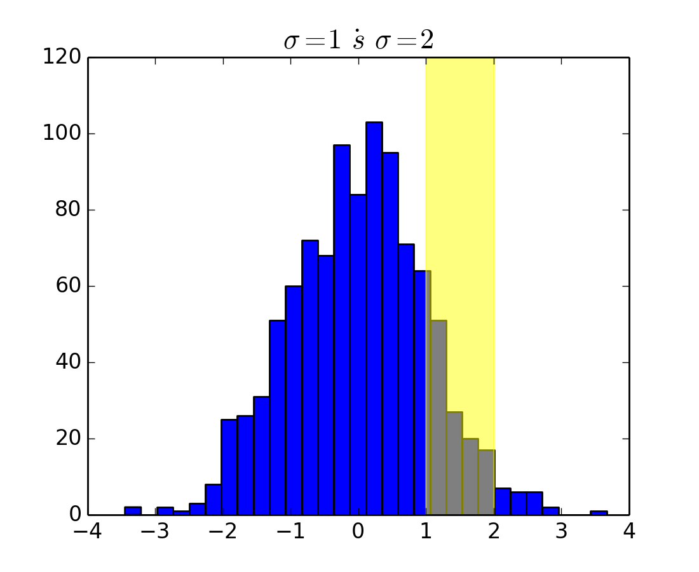

# Paper Presentation

-   Title: A tutorial on **generalized eigendecomposition** for **denoising, contrast enhancement, and dimension reduction** in multichannel electrophysiology

-   Author: Michael X Cohen

-   Publisher: Elsevier, NeuroImage

-   _Presentation: Chuncheng Zhang_

---

# Toc

-   [Paper Presentation](#paper-presentation)
-   [Toc](#toc)
-   [Toc](#toc-1)
-   [Background & Motivation](#background--motivation)
    -   [Sources in NeuroScience](#sources-in-neuroscience)
    -   [Source Separation](#source-separation)
    -   [Multivariate Analysis - Why](#multivariate-analysis---why)
    -   [Multivariate Analysis - Others](#multivariate-analysis---others)
    -   [Multivariate Analysis - GED](#multivariate-analysis---ged)
-   [Mathematical & Statistical](#mathematical--statistical)
    -   [Math of GED](#math-of-ged)
    -   [Inferential Statistics](#inferential-statistics)
    -   [Permutation Tests](#permutation-tests)

---

# Toc

-   [Explain GED](#explain-ged)
    -   [Assumptions](#assumptions)
    -   [Simple Spatial Filters](#simple-spatial-filters)
    -   [Simulation Results](#simulation-results)
-   [When GED Fails:](#when-ged-fails)
    -   [Avoid Trivial Solution](#avoid-trivial-solution)
        -   [Solution](#solution)
    -   [Avoid Overfitting](#avoid-overfitting)
        -   [Solution](#solution-1)
    -   [NonLinear](#nonlinear)
        -   [Solution](#solution-2)
    -   [Complex GED solutions](#complex-ged-solutions)
        -   [Solution](#solution-3)
-   [Where to Blame](#where-to-blame)

---

# Background & Motivation

## Sources in NeuroScience

**Separating** sources of cognitive and neural processes is one of the major challenges in neuroscience research.

**Source** has several interpretations:

-   A single physical location in the brain
-   A distributed set of locations
-   A neural ensemble
-   A single neuron, synapse
-   A cognitive operation
-   A computational algorithm that a neural ensemble produces
-   A neuroChemical modulation, etc.

---

## Source Separation

> **Descriptive-statistical separation**

-   The sources are **isolated** based on spatiotemporal patterns in a channel covariance matrix.

-   Stem from an anatomically distributed but **synchronous** network.

-   GED extract the sources according to

    -   Descriptive-statistical criterial
    -   The information contained in covariance matrices.

---

## Multivariate Analysis - Why

The manifest variables (a.k.a. observable data) that we measure (voltage fluctuations in electrodes) are indirect and comprise mixtures of the latent constructs we seek to understand.

The argument here is not that mass-univariate analyses are wrong or misleading;

Rather, the argument is that progress in neuroscience will be accelerated by shifting to conceptualizing and analyzing data with the goal of isolating and extracting information that is **distributed across a set of electrodes**.

---

## Multivariate Analysis - Others

-   PCA

    -   It is descriptive as **opposed to inferential**;
    -   The PC vectors are constrained to be **orthogonal** in the channel space;
    -   Maximizing variance does not necessarily **maximize relevance**.

-   ICA

    -   It is often used as a descriptive measure, but cross-validation methods exist for evaluating statistical significance of individual components.

-   Decoding (linear)

    -   It **discards** a considerable amount of rich and meaningful spectral and temporal variability.

-   Deep learning

    -   It is of **limited** value for providing mechanistic insights;
    -   Deep learning and linear decompositions could be used **synergistically**.

---

## Multivariate Analysis - GED

GED as a tool for denoising, dimension reduction, and source separation of multichannel data has several advantages.

-   **Hypotheses Driven**:

    -   GED is based on specifying hypotheses;
    -   GED allows for inferential statistics to determine whether a component is significant;

-   **ConstraintLess**:

    -   GED has only a few key researcher-guided analysis choices;
    -   GED requires no spatial or anatomical constraints;
    -   GED allows for individual differences in topographies;

-   **Easy to Implement**:

    -   GED is deterministic and non-iterative;
    -   GED has a long history of applications in statistics, machine learning, engineering, and signal processing.

---

# Mathematical & Statistical

## Math of GED

The goal is Maximizing $\lambda$

$$\lambda = \frac{||w^T X_S||^2}{||w^T X_R||^2} = \frac{w^T S w}{w^T R w}$$

Solution

$$W \Lambda = B W, B = R^{-1} S$$

Compare with PCA

$$W \Lambda = S W, (R = I)$$

> GED equals to PCA if $R=I$

---

## Inferential Statistics

The null hypothesis is

$$R = S \\ ||w^T X_R||^2 = ||w^T X_S||^2$$

it drives

$$\lambda = 1$$

what distribution does $\lambda$ follow?

-   Normal distribution? Absolutely No.
-   Chi-squares distribution? Possible, but not always.

## Permutation Tests

The permutation of $\lambda$ is derived from shuffling the samples in $X_S$ and $X_R$.

---

# Explain GED

## Assumptions

-   **Linear**: Signals mix linearly in the physical data channels. This assumption is necessary because GED is a linear decomposition.

-   **Stable**: The targeted features of the data are stable within the windows used to construct the covariance matrices.

-   **Meaningful**: Covariance is a meaningful basis for source separation.

-   **Interpretable**: The data features used to create the $S$ and $R$ matrices are physiologically or cognitively sufficiently different to produce an interpretable spatial filter.

---

## Simple Spatial Filters

The GED estimates spatial filters to the data.

-   The topographies of the spatial filter is the $w$ vector,
-   The temporal waveform is the projection $w^T X$,
-   The power ratio of the filter is the determine value $\lambda$.

---

## Simulation Results

Isolating an alpha band component embedded in noise during simulated resting-state data.

---

# When GED Fails:

## Avoid Trivial Solution

The functional has **not valid** solution when

$$R=\bold{0}$$

in the measurement of $\forall w$

$$w^T X_R = \bold{0} \\ w^T X_S \neq \bold{0}$$

which drives overfitting

$$\frac{||w^T X_R||^2}{||w^T X_S||^2} \rightarrow \infty$$

Solution is using shrinkage $\widetilde{R}$

$$\widetilde{R} = (1-\gamma) R + \gamma \alpha \bold{I}$$

### Solution

> Use Shrinkage Method to avoid trivial solution

---

## Avoid Overfitting

-   **3rd-party Evidence**: Apply statistical contrasts that are orthogonal to the maximization criteria.

-   **Cross-validation**: Use cross-validation to evaluate generalization performance.

-   **Independent**: Create the spatial filter based on independent data.

-   **Statistics**: Apply inferential statistics (via permutation-testing) to evaluate the probability that a component would arise given overfitting of data when the null hypothesis is true.

### Solution

> Use Everything to avoid overfitting,

---

## NonLinear

Because GED is a linear decomposition, nonlinear distributed sources may not be suitably captured by GED. The black lines in the left panel show the GED eigenvectors.

### Solution

> Use Kernel method like SVM (Not mentioned in the paper)

---

## Complex GED solutions

-   Recall

    The GED is Maximizing $\lambda$

    $$\lambda = \frac{||w^T X_S||^2}{||w^T X_R||^2} = \frac{w^T S w}{w^T R w}$$

    the solution is obtained

    $$W \Lambda = B W, B = R^{-1} S$$

-   Problem

    The Eigen decomposition is not necessarily real-valued.
    The reason is **Bad Data**

    > Complex solutions can arise if the covariance matrices are reduced rank or ill-conditioned and usually indicate that the covariance matrices have poor signal-to-noise characteristics, reduced rank, or that $S$ and $R$ are difficult to separate.

---

### Solution

-   **More Data**: Use more data to create the covariance matrices (e.g., longer time windows or wider spectral bands, or more trials);

-   **Better Contrast**: Redefine the GED contrast so that the matrices are more separable (e.g.,all conditions against the inter-trial-interval instead of one condition against another);

-   **PCA**: If the data are reduced-rank, compress the data from $M$ (channels) to $r$ (matrix rank) dimensions, e.g., using PCA, and then run GED on the compressed-data covariance matrices;

-   **Shrinkage**: Apply regularization to fill in null dimensions and thus force the rank to $M$.

-   In one word,
    > If you read some large image value, there are something going very wrong.

---

# Where to Blame

